<div align="center">

# ✨ NeonHub

**An AI-generated product catalog feeding a fast, SEO-optimized storefront.**
NeonHub is a neon-sign business with a home-grown pipeline that does two hard things: it **mass-generates its entire product catalog with AI** (Google's Gemini "Nano Banana" image models via the **Batch API at -50% cost**), and it **serves that catalog as a blazing-fast, SEO-engineered static storefront**. This repo is the full ecosystem: the admin cockpit, the storefront, and the neon-engineering tools, cleaned and documented for showcase.


[Architecture](docs/architecture.md) · [Hero A: AI catalog](docs/ai-catalog-pipeline.md) · [Hero B: SEO/perf](docs/seo-performance.md) · [The model](#-the-model-an-ai-native-business) · [Screenshots](#-screenshots) · [Build & run](#-build--run)

<br/>
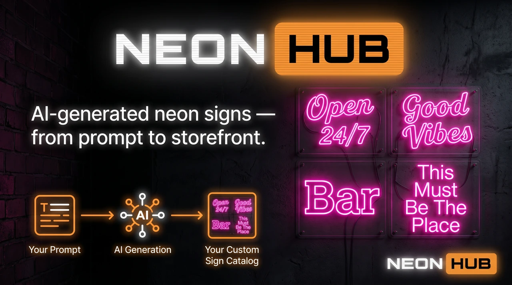

</div>

---

## What it is

NeonHub (live as **neonhub.ru**) sells custom neon signs. Behind it is an end-to-end content + commerce pipeline:

1. **Generate**: an admin cockpit builds thousands of image-generation tasks from an *idea × prompt* matrix and ships them to Gemini in **50-row batches via the Batch API (-50% cost)**.
2. **Curate**: a human triages the generated images (cool/defect, hero pick, colors/categories/sizes) into an approved catalog.
3. **Serve**: a Next.js **static-export** storefront bakes that catalog into fast, fully SEO-optimized pages.
4. **Spec**: a set of neon-engineering tools compute the per-product size, wiring, and mask data the catalog needs.

## 🏗 Architecture

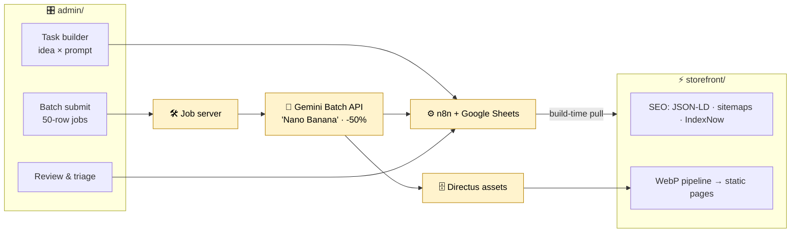

> **Honesty note (important).** The yellow nodes (**n8n**, the **job server**, the **Gemini Batch API** call, and **Directus**) are external infrastructure. This repo ships the two **Next.js apps** + the **tools**; the external orchestration/worker layer is *described*, not included. The admin app shows the exact batch-submit-then-poll *shape*; the actual Gemini Batch request and API key live in the job server / n8n. Full detail in [docs/architecture.md](docs/architecture.md).

## 🌟 The two hero stories

### A: A fully AI-generated catalog (Gemini Batch, -50% cost)
The catalog isn't photographed. It's generated. Prompts × ideas fan out into fixed-size async **batches** submitted to Gemini's **Batch API**, billed at **half** the interactive rate; results are polled by `job_id` and funneled through human triage. **Proven scale: 2,580 products, 103 batch jobs, 8,427 generations.** → [docs/ai-catalog-pipeline.md](docs/ai-catalog-pipeline.md)

### B: A fully SEO-optimized, very fast storefront
A Next.js **static export** with per-product `generateMetadata`, JSON-LD (Organization / Product / Breadcrumb), sitemaps + a dedicated **image sitemap**, **IndexNow** on every deploy, a **WebP** image pipeline, `next/font` swap, and a low-end-device detector. SEO as the architecture, not an afterthought. → [docs/seo-performance.md](docs/seo-performance.md)

## 🔮 The model: an AI-native business

NeonHub is a small shop, but it's an early example of a new kind of business: **AI generates the product photos, AI builds the storefront, automation processes the orders, and the only human step left is making and delivering the physical goods.**

The catalog that once needed a photographer and a content team is now a prompt library and a batch job; the storefront that once needed a dev shop builds and indexes itself. Everything on the digital side scales with **compute, not headcount**, so the business stays tiny while the catalog goes wide. This is the shape a lot of product businesses will take, and NeonHub already runs it end to end. → **[Read the full thesis](docs/ai-native-business.md)**

## 📸 Screenshots

### The AI-catalog admin: Hero A
<table>
<tr>
<td width="50%">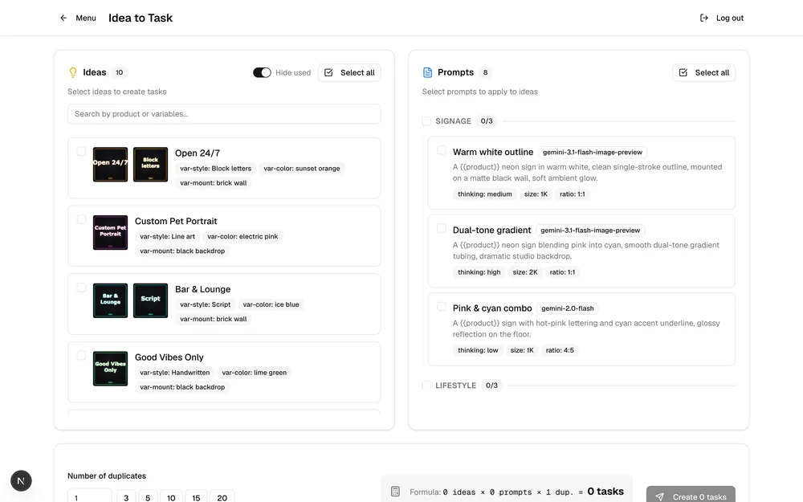<br/><sub>Idea × prompt task builder, the cartesian matrix</sub></td>
<td width="50%">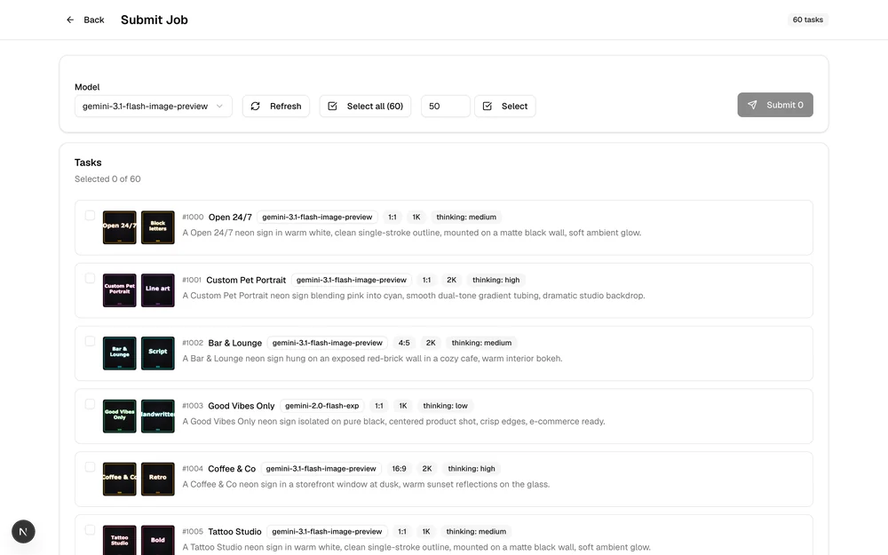<br/><sub>Batch submit: 50-row Gemini jobs</sub></td>
</tr>
<tr>
<td width="50%">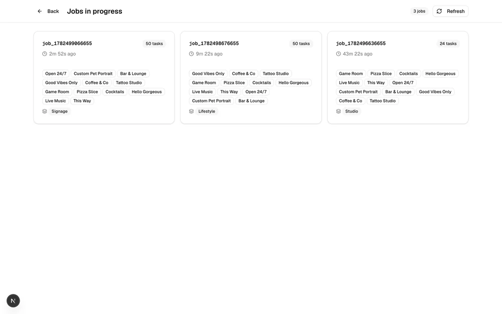<br/><sub>Job monitor, in-flight batches by job_id</sub></td>
<td width="50%">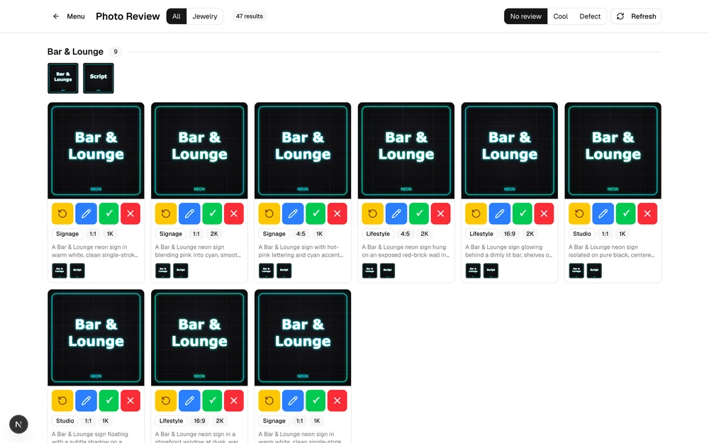<br/><sub>Photo review: triage generated images into the catalog</sub></td>
</tr>
</table>

### The storefront: Hero B
<table>
<tr>
<td width="50%">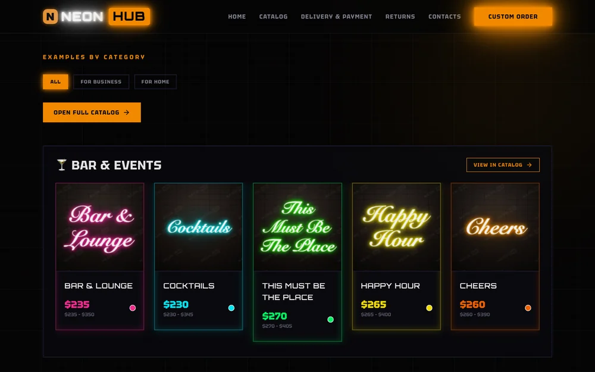<br/><sub>Home: neon catalog by category</sub></td>
<td width="50%">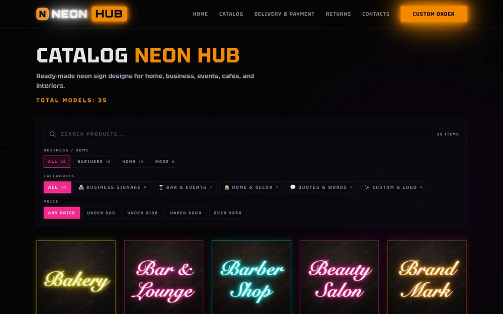<br/><sub>Catalog: filters, search, SEO category pages</sub></td>
</tr>
<tr>
<td width="50%">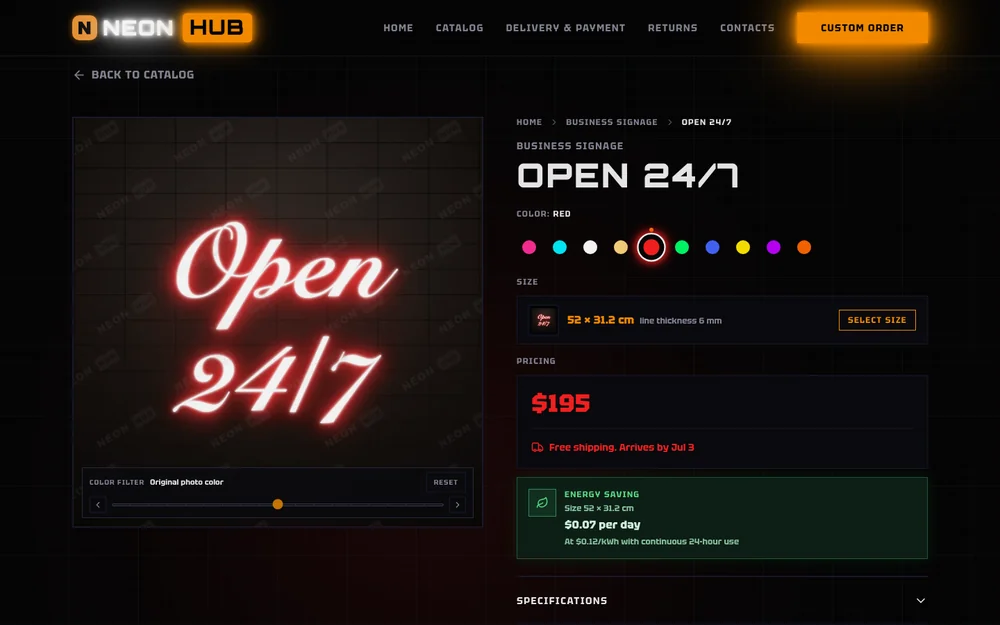<br/><sub>Product: colors, sizes, JSON-LD structured data</sub></td>
<td width="50%"><br/><sub>Responsive / mobile</sub></td>
</tr>
</table>

### The tools
<table>
<tr>
<td width="33%">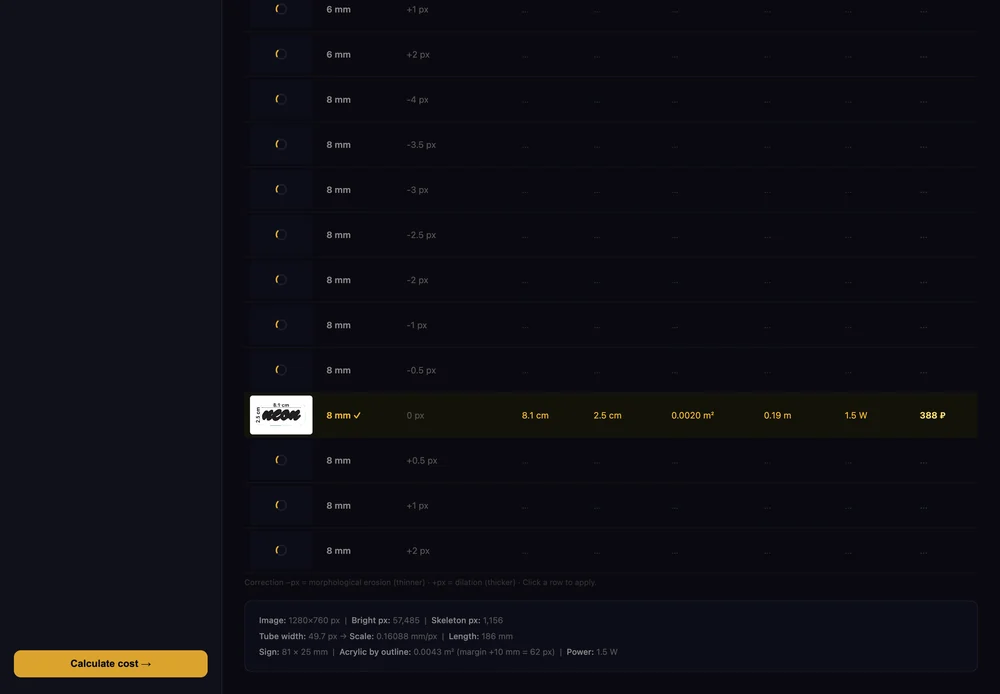<br/><sub>Size analyser: photo → length, power, price</sub></td>
<td width="33%">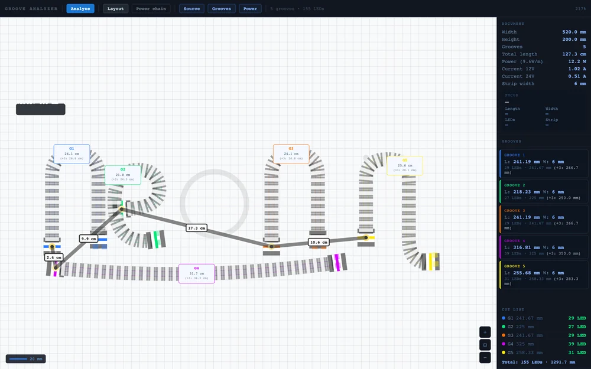<br/><sub>Groove analyser: SVG → wiring plan</sub></td>
<td width="33%">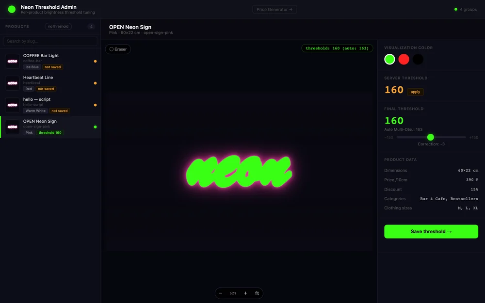<br/><sub>Threshold admin: neon-mask tuning</sub></td>
</tr>
</table>

<sub>Storefront rendered from the real static export (neon-style demo catalog); the admin is the real app with sample data via a mock backend; the tools are real runs.</sub>

---

## 📁 Repository structure

```text
neonhub-case/
├── admin/        AI-catalog orchestration UI (Next.js): task builder · batch submit · triage
├── storefront/   SEO/perf static-export storefront (Next.js) = neonhub.ru
├── tools/
│   ├── size-analyser/    photo of a sign → tube length, dimensions, power, price (CV)
│   ├── groove-analyser/  routed-groove SVG → length, LED cuts, serial power-wiring plan
│   └── threshold-admin/  per-product brightness-threshold tuning for clean neon masks
└── docs/         architecture · AI-catalog pipeline · SEO & performance
```

Each component has its own README and `.env.example`.

## 🛠 The tools

| Tool | Input → Output | Notable engineering |
|---|---|---|
| **size-analyser** | one photo of a lit sign → tube length, dimensions, cover area, power, price | luminance histogram → Multi-Otsu → morphology → **Zhang-Suen skeletonization** → pixel-to-mm scale |
| **groove-analyser** | routed-groove SVG → per-groove length, LED cut marks, full wiring plan | SVG path lengths → endpoint graph → **Dijkstra + greedy** serial-chain power routing |
| **threshold-admin** | product image → tuned brightness threshold + clean mask | interactive eraser brush, env-driven asset save-back |

## 🚀 Build & run

<details>
<summary><b>admin/ - AI-catalog orchestration UI</b></summary>

```bash
cd admin
cp .env.example .env.local     # N8N_BASE_URL · JOB_SERVER_URL · NEXT_PUBLIC_DIRECTUS_URL · NEXT_PUBLIC_ADMIN_PASSWORD
npm install
npm run dev
```
The app talks to an external n8n + job server (see `.env.example`). See [`admin/README.md`](admin/README.md).
</details>

<details>
<summary><b>storefront/ - SEO/perf static export</b></summary>

```bash
cd storefront
cp .env.example .env           # NEXT_PUBLIC_SITE_URL · PRODUCTS_API_URL · INDEXNOW_* · analytics
npm install
npm run build                  # static export → out/   (npm run dev for local)
```
Ships with a trimmed **English demo catalog**; the real site runs the same pipeline over the full catalog. See [`storefront/README.md`](storefront/README.md).
</details>

<details>
<summary><b>tools/ - neon calculators</b></summary>

```bash
cd tools/size-analyser   && cp .env.example .env && npm install && npm start   # Directus via env
cd tools/groove-analyser && npm install && npm start
cd tools/threshold-admin && cp .env.example .env   # static + serverless api/
```
See each tool's README.
</details>

## 📄 License

Released under the [MIT License](LICENSE).

## 👤 Author

**Alex Polezhaev**, full-stack engineer.
I build end-to-end products across AI pipelines, web, and automation. **Relocating to the United States, open to roles.**

- GitHub: [@alex-polezhaev](https://github.com/alex-polezhaev)
- Email: polezhaev.advert@gmail.com
