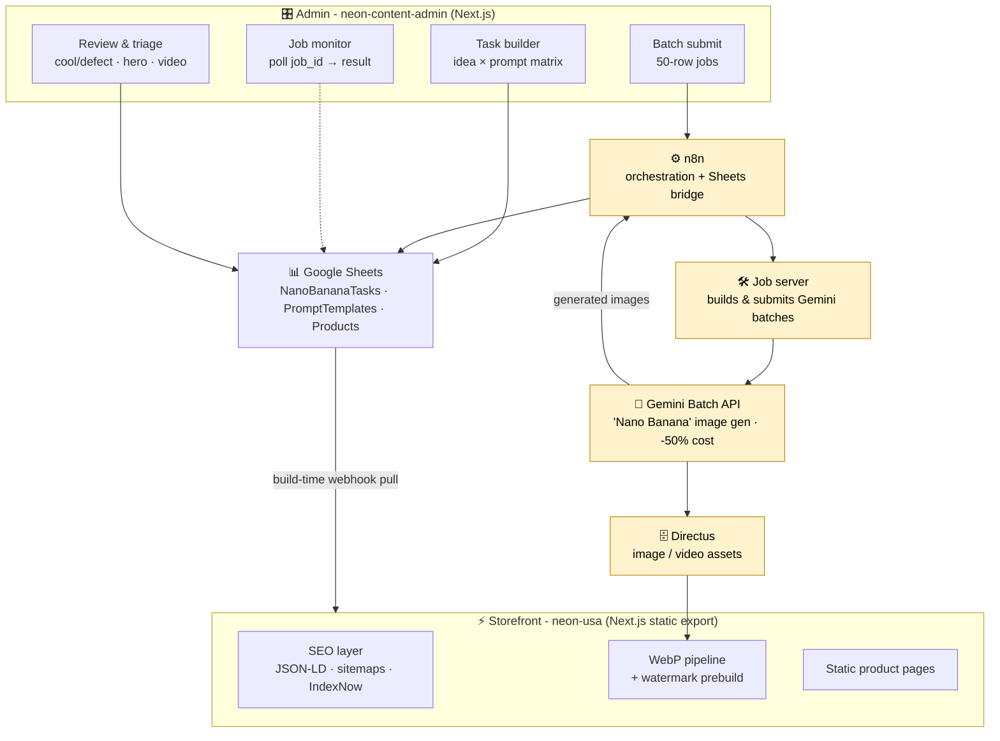

# Architecture

NeonHub is a small neon-sign business with a home-grown pipeline that does two hard things well: it **mass-generates its product catalog with AI**, and it **serves that catalog as a fast, SEO-optimized static storefront**. Everything in this repo orbits those two flows.

## The whole system

> **Honesty note.** The yellow nodes (**n8n**, the **job server**, the **Gemini Batch API** call, and **Directus**) are external infrastructure. This repository contains the two **Next.js applications** (admin + storefront) and the **calculator tools**. The external orchestration/worker layer is *described* here, not shipped. The admin app shows the exact shape of the batch flow (build tasks → submit 50-row batches → poll by `job_id` → results arrive as asset URLs); the actual Gemini Batch request, API key, and polling against Google live in the job server / n8n workflow.

## The shared spine

| Service | Role | In this repo? |
|---|---|---|
| **Admin** (`admin/`) | Next.js UI that builds image tasks, submits batches, monitors jobs, triages results | ✅ yes |
| **Storefront** (`storefront/`) | Next.js static-export site that bakes the catalog into fast, SEO-rich pages | ✅ yes |
| **Tools** (`tools/`) | Calculators that produce per-product specs (size, wiring, mask threshold) | ✅ yes |
| **n8n** | Workflow engine; bridges the apps to Google Sheets; holds catalog webhooks | ➖ external (described) |
| **Job server** | Takes 50-row batches and submits them to the Gemini Batch API | ➖ external (described) |
| **Gemini Batch API** | "Nano Banana" image generation at **-50%** of interactive pricing | ➖ external (Google) |
| **Directus** | Stores every reference image and generated asset | ➖ external (described) |
| **Google Sheets** | The data store for tasks, prompts, ideas, products | ➖ external (described) |

## Data flow in one pass

1. **Author** image-generation tasks in the admin from an *idea × prompt-template* matrix (see [ai-catalog-pipeline.md](ai-catalog-pipeline.md)).
2. **Submit** them in 50-row batches; the external job server hands each batch to the **Gemini Batch API** and returns a `job_id`.
3. **Poll** until generated images land back (as Directus asset URLs) on the task rows.
4. **Triage**: mark images cool/defect, choose the hero per product, assign colors/categories/sizes, approve.
5. **Publish**: the storefront pulls the approved catalog at build time, converts images to WebP, and emits a fully static, SEO-optimized site (see [seo-performance.md](seo-performance.md)).

## Why it's built this way

- **Sheets + n8n as the backplane.** Non-technical catalog work (ideas, triage verdicts, approvals) happens in a spreadsheet; n8n moves data without a bespoke backend.
- **Batch over interactive.** Catalog generation is not latency-sensitive, so it runs through the **Batch API at half the cost**, the right trade for thousands of images. *(Proven scale: ~2,580 products across 103 batch jobs, 8,427 generations.)*
- **Static export for the storefront.** A catalog that changes at build time, not per request, should ship as static HTML: fastest possible TTFB and trivial caching/CDN.
